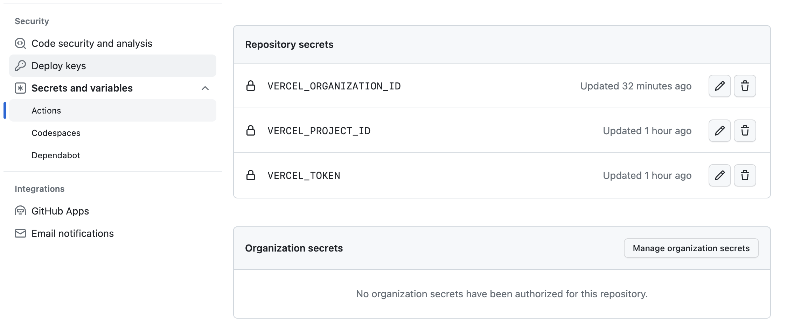
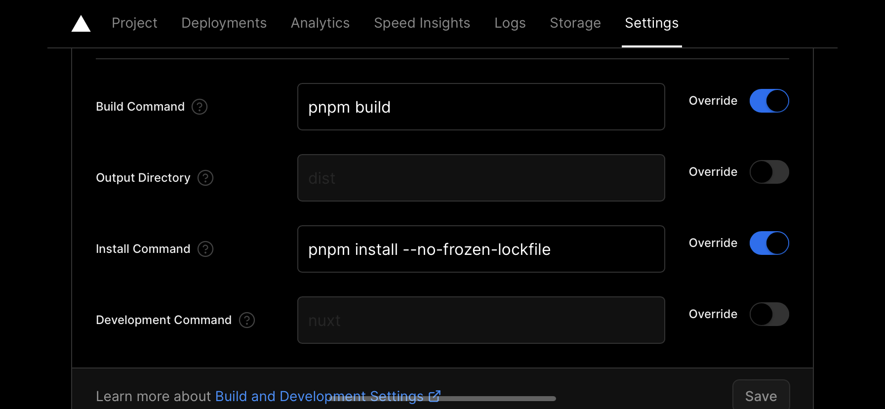

# Создание и добавление токена Vercel

Для начала, необходимо создать токен в сервисе Vercel. Для этого необходимо:

1. Перейти в настройки аккаунта;
2. Зайти в раздел "Tokens";
3. Создать новый токен с правами на деплой проектов.

После создания токена, необходимо добавить его в Github. Для этого необходимо перейти в настройки репозитория, затем в раздел "Secrets". Создать новый секрет с именем `VERCEL_TOKEN` и значением, равным созданному токену.

Мы также должны взять Project ID и Organization ID, для того чтобы деплоить с помощью Github Actions.



# Создание экшена

Теперь нам нужно написать экшен для Github Actions, который при пуше в ветку main будет заливать наш проект на продакшен:

```yaml
name: Vercel Deploy
on:
  push:
    branches:
      - main
jobs:
  deploy:
    runs-on: ubuntu-latest
    steps:
      - uses: actions/checkout@v2
      - name: Deploy
        uses: amondnet/vercel-action@v20
        with:
          vercel-token: ${{ secrets.VERCEL_TOKEN }}
          vercel-args: '--prod'
          vercel-org-id: ${{ secrets.VERCEL_ORGANIZATION_ID}}
          vercel-project-id: ${{ secrets.VERCEL_PROJECT_ID}}
          working-directory: ./
```

Все было бы хорошо, но как часто бывает - мы ~~вставляем себе палки в колеса~~ используем более продвинутые технологии, в данном случае я использовал [pnpm](https://pnpm.io/).

::ContentDetails
---
title: Что такое pnpm?
emoji: 🤔
---
[pnpm](https://pnpm.io/) - это менеджер пакетов для JavaScript, который предоставляет более быстрый и
эффективный способ установки и управления зависимостями для проектов.
В отличие от других менеджеров пакетов, он использует разделяемые пакеты, что позволяет экономить
дисковое пространство и ускоряет установку зависимостей.
::

Когда я посмотрел на логи билда в Vercel, я увидел следующее:

```bash
ERR_PNPM_OUTDATED_LOCKFILE
Cannot install with "frozen-lockfile" because pnpm-lock.yaml is not up to date with package.json
```

Я так и не выяснил причины данной ошибки,  хотя и перепробовал все решения что были на Stack Overflow (переустановка зависимостей, удаление `pnpm-lock.yaml`, удаление `.npmrc`), поэтому пока что поставил специальную команду для установки зависимостей в Vercel:


