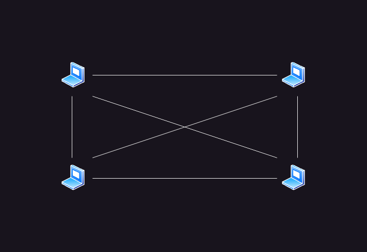
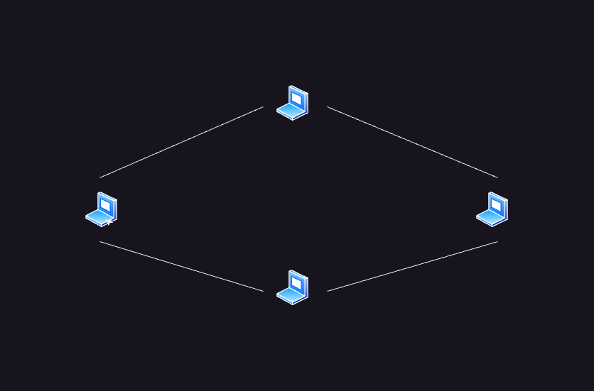
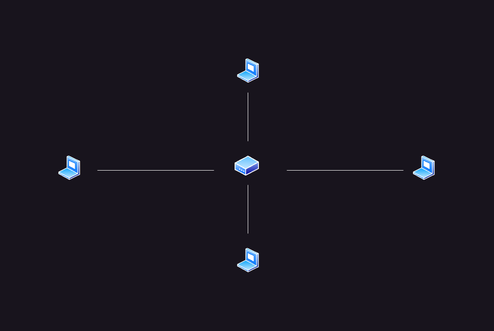
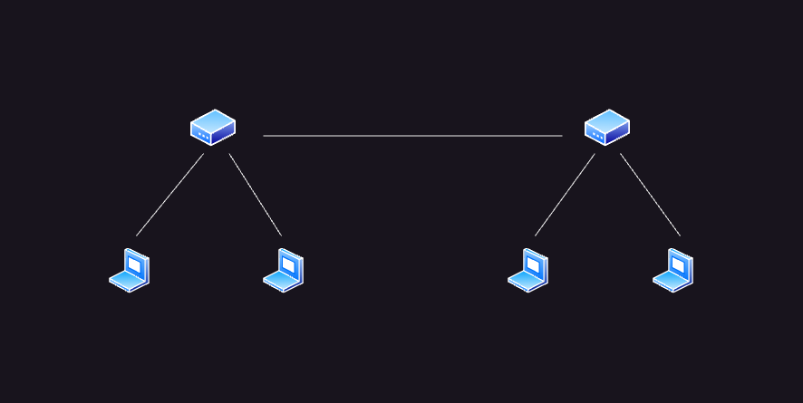
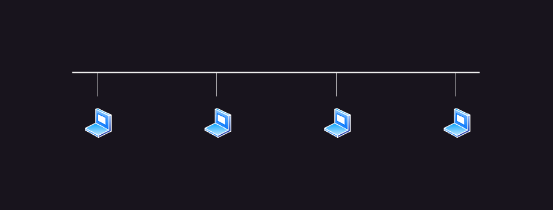

**Компьютерные сети** - наука и методология о том как эффективно связать несколько устройств для обмена сообщениями.

Классификация сетей:

- **Персональная** - сеть протяженностью не более 1 метра. Для примера можно взять роутер и ПК, которые соединены через LAN-кабель
- **Локальная**- сеть протяженностью от 10 метров до 1 километра. В основном покрывает какую-то комнату или здание.
- **Глобальная** - сеть протяженность от 100 до 1000 километров. Такую сеть предоставляет провайдер страны, для того чтобы обеспечить комуникацию и связь с другими сетями.
- **Объединение сетей** - сеть неограниченной протяженностью. Объединяет глобальные сети по всему миру.

# Топология сетей

Каждую компьютерную сеть можно описать в виде графа, где вершинами выступают хосты (компьютеры и сетевое оборудование), а ребрами - связи между ними.

Существуют несколько топологий сетей:

**Полносвязная**. Это топология, где все хосты связаны с другими хостами. Если существуют два хоста, то графом будет прямая линия, если хоста три, то граф будет представлен в виде треугольника, если хоста 4, то граф будет представлен как квадрат с двумя диагоналями и так далее. Среди достоинств данной топологии то, что у каждого хоста есть прямой канал к другому хосту, не нужно искать маршрут по которому нужно отправить пакет. Недостатком же является то, что для такой топологии нужно очень много сетевых адаптеров.

**Кольцо**. В данной топологии граф представляет из себя окружность, где каждый хост соединен с двумя соседними хостами (слева и справа), передача данных по такой топологии осуществляется по кругу (по часовой или против часовой стрелки).

**Звезда**. Это топология где всех хосты подключены к одному маршрутизатору. Когда один хост хочет отправить сообщение другому хосту, он делает это через посредника (маршрутизатор).

**Дерево**. В данной топологии граф представляет из себя дерево, где на нижнем уровне располагаются хосты, а в верхних уровнях располагаются маршрутизаторы.

**Общая шина**. Это топология, где все компьютеры соедиены общей шиной. При отправке данных одним хостом - данные доступны всем хостам, которые пользуются той же общей шиной.

> На практике часто используются смешанные топологии. Например, маршрутизаторы могут соединяться с друг-другом с помощью кольца и иметь связи с несколькими хостами. В данном случае это топология «Кольцо» и «Звезда».

## Физическая и логическая топология

**Физическая топология** - это соединение устройств в сети с помощью кабелей и других проводников.

**Логическая топология** - это правила распространения сигналов в данной сети.

